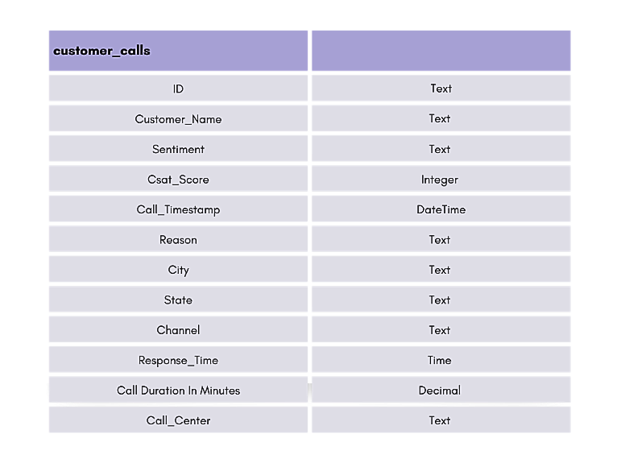
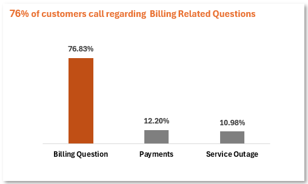
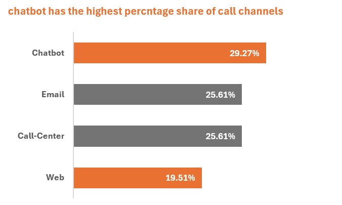
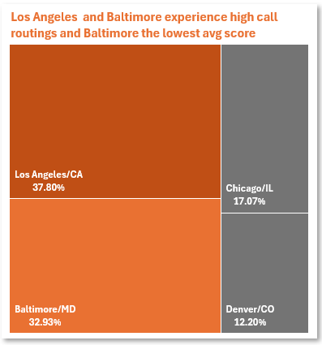
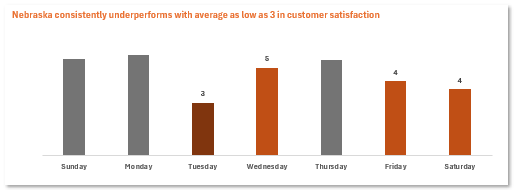
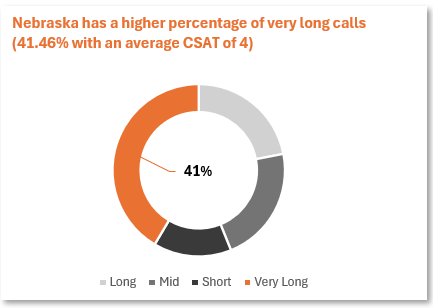

##  Table of Contents

1. [Project Background](#project-background)
2. [Data Structure & Initial Checks](#data-structure-&-initial-checks)
3. [Executive Summary](#executive-summary)
4. [Insights Deep Dive](#insights-deep-dive)
5. [Recommendations](#recommendations)
6. [Assumptions and Caveats](#assumptions-and-caveats)

# Project Background
ConnectX is a national telecom provider offering internet, mobile, and TV services. With multiple call centers across the U.S., they receive thousands of support calls each day.
Lately, the leadership team raised concerns about declining and inconsistent CSAT (Customer Satisfaction) scores and a noticeable increase in negative customer feedback.  As a data analyst embedded within the operations team, my role is to deliver actionable insights to help leadership make data-informed decisions
This project conducts a deep analysis on a one-month worth of call center performance data to identify problem areas, optimize operations, and recommend strategies to enhance both service quality and customer satisfaction.
Out of a total of 32,941 call records, only 12,271 entries included valid Customer Satisfaction (CSAT) scores, while 20,670 records lacked CSAT data.
To maintain analytical integrity, CSAT-specific insights are based exclusively on the 12,271 scored records, while operational trends (like call volume, response time, and duration) where applicable.

Insights and recommendations are provided on the following key areas:

- **CSAT scores by state** 
- **CSAT vs reason for call**
- **CSAT vs channel**
- **CSAT vs response time**
- **Call duration patterns (cross-check for hidden lag)**
- **CSAT by Date Trend**
  
The excel formulas and steps used to clean, organize and prepare data for the dashboard can be found here [Data Cleaning Log](Documentation/ConnectX-Data-Cleaning-Documentation.pdf)

An interactive Excel dashboard can be downloaded here [Dashboard](Visuals/Nebraska-Dashboard.PNG)

# Data Structure & Initial Checks 
ConnectX database structure as seen below with a total of 12,227 records

# Executive Summary
### Overview of Findings
From the analysis of 12,227 survey responses, Nebraska emerged as the state with the lowest CSAT scores (average score: 4.88 out of 10) across the U.S. 

*	**High Billing Call Volume & Low Satisfaction:** Nebraska has a significantly higher percentage of billing-related calls (76.8%, 5.5 points above the national average). Importantly, Customer Satisfaction (CSAT) scores are lower than the national average across all call reasons, indicating a systemic issue beyond just billing volume.

*	**Negative Customer Sentiment:** Feedback from Nebraska customers is overwhelmingly negative (58.5% Negative/Very Negative vs. 51.8% nationally). Conversely, very positive sentiment is significantly lower than the national average, suggesting customers begin interactions with negative feelings that are exacerbated by current processes.

*	**Ineffective Routing to Baltimore:** A large portion of Nebraska calls are routed to support centers in Baltimore and Los Angeles. The CSAT for Nebraska customers handled by the Baltimore center is significantly lower (4) compared to the national average (6), strongly suggesting that Baltimore support is a major contributor to Nebraska's low customer satisfaction.
   
**Overall Implications:**
Nebraska faces a customer support crisis characterized by frequent, frustrating billing issues, a prevailing negative sentiment that is not being effectively addressed, and a detrimental mismatch between Nebraska customers and the Baltimore call center. These interconnected factors are significantly undermining customer satisfaction in the state.

# Insights Deep Dive
### Dominance of Billing Questions
  - A significantly higher percentage of calls in Nebraska (76.8%) are billing-related compared to the national average (71.3%).
  - CSAT scores in Nebraska are lower across all call reasons.

  

### Ineffective Support Channels
  - Over-reliance on chatbots, which perform poorly, hinders positive outcomes.
  - Potentially underutilized or undertrained call center agents hinder positive outcomes

   

### Problematic Call Center Routing
  - Nebraska customers are primarily routed to call centers in Baltimore and Los Angeles.
  - These call centers exhibit lower performance for Nebraska customers compared to the average performance across all states.
  - Baltimore appears to be key areas of concern for Nebraska's customer satisfaction.
  - Nebraska's average CSAT score for calls handled by these centers is 4, compared to a national average of 6, representing a significant two-point decline.

   

### CSAT by Day of Week Trend
  - Nebraska consistently underperforms in customer satisfaction on Tuesday, Wednesday, Friday, and Saturday, with CSAT dropping as low as 3, compared to a national average of 6.
  - Spikes in low scores align with specific dates—notably 2nd, 13th, 21st, and 24th—likely tied to billing cycles, system delays, or service backlogs.

   

### Poor Call Execution
  - Nebraska has a higher percentage of very long calls (41.46% with an average CSAT of 4) compared to the national average (37.19% with an average CSAT of 6), indicating lower satisfaction during these longer calls.
  - This suggests that the duration of calls alone is not the problem, as other states handle long calls with better customer satisfaction. Nebraska's handling of long calls is failing to meet customer expectations.
  - While Nebraska experiences a higher proportion of longer calls, the fundamental issue lies in the quality of the interactions occurring during these calls, rather than just the length of the call.

 

### Negative Customer Sentiment
  - customers express more negative feedback (58.5%) compared to the national average.
  - Nebraska customers express less very positive feedback compared to the national average.
  - This results in lower CSAT scores for negative feedback in Nebraska.
    

# Recommendations
*	 **Reduce Chatbot dependency in Nebraska:** Shift more calls to human agents. Re-train chatbot decision trees to escalate quicker when CSAT is trending low.

*	**Prioritize Billing Question training for agents:** Deploy specialized billing issue teams to handle Nebraska traffic and reduce pain points faster.

*	**Reassign Nebraska calls away from low-performing centers:** Route fewer calls to Baltimore and LA. Test rerouting to higher-CSAT centers (Denver/CO) to observe improvements.

*	**Investigate call handling quality during long calls:** Use call recordings and QA scoring to assess what’s going wrong in lengthy Nebraska calls.

*	**Sentiment-triggered escalation paths:** Design workflows that detect rising customer frustration and automatically trigger escalation or supervisor intervention.

*	**Investigate Staffing and Process Optimization:** Analyze failures in staffing and processes on critical dates and focus on improving workflows on weekdays where difficulties are most prevalent.

# Assumptions and Caveats
Throughout the analysis, multiple assumptions were made to manage challenges with the data. These assumptions and caveats are noted below:

* **Assumption:** Missing CSAT values were excluded from analysis due to randomness and lack of patterns.
  
* **Assumption:** All call timestamps were in local time zones; no time zone normalization was applied.

* **Assumption: SLA Terminology:**
  - Within SLA = Response time met target.
  - Above SLA = Response time exceeded target (slow response).
  -	Below SLA = Interpreted as “exceptionally fast response,” faster than SLA requirement.
     - We assume “Below SLA” to be a positive performance indicator and grouped it under “On Time.”
     - No metadata on SLA time limits was provided, so this classification is based on typical industry interpretations.

* **Caveat:** Out of 32,941 records, 20,670 are missing CSAT scores (~63%), which limits the strength of insights. Analysis focused on the remaining 12,271 rows.
* **Caveat:** Agent performance was evaluated only on CSAT and not on internal QA audits.

